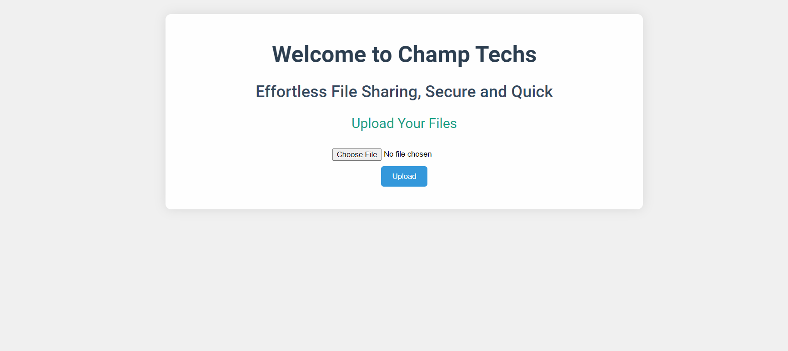
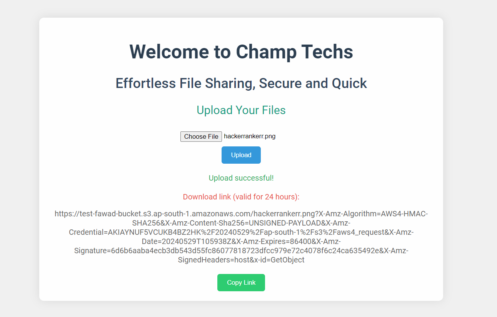
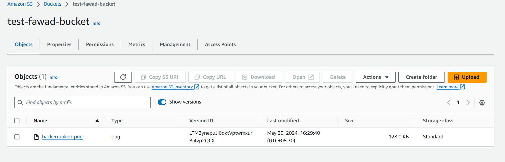

# Cloud File Uploader: Secure File Sharing with AWS S3

Welcome to Cloud File Uploader! This project allows users to upload files to AWS S3 and generates a temporary link for sharing, which expires after 24 hours.

## Features

- **File Upload**: Users can upload files through a simple web interface.
- **AWS S3 Integration**: Files are stored securely in AWS S3.
- **Temporary Links**: Generate a presigned URL that expires after 24 hours for secure sharing.

## Tech Stack

- **Frontend**: HTML, CSS, JavaScript
- **Backend**: Node.js, Express.js
- **Storage**: AWS S3
- **File Handling**: Multer

## Setup Instructions

### Prerequisites

- Node.js (version 14 or later)
- AWS account with S3 access

### Step 1: Clone the Repository

```bash
git clone https://github.com/skfawad911/Cloud-File-Uploader-Secure-File-Sharing-with-AWS-S3.git
```

### Step 2: Install Dependencies
```bash
npm install
```
### Step 3: Configure AWS Credentials
```bash
AWS_REGION=your-region
AWS_ACCESS_KEY_ID=your-access-key-id
AWS_SECRET_ACCESS_KEY=your-secret-access-key
S3_BUCKET_NAME=your-bucket-name
```
### Step 4: Run the server
```bash
node server.js
```
The server will start on port 3000. Open your browser and navigate to http://localhost:3000 to access the web interface.

## Usage
- Upload a File: Select a file using the upload form and click the "Upload" button.
- Get the Link: A link will be generated and displayed on the screen, along with a copy button.
- Share the Link: Use the link to share the file. Note that the link will expire after 24 hours.

### Website Preview



